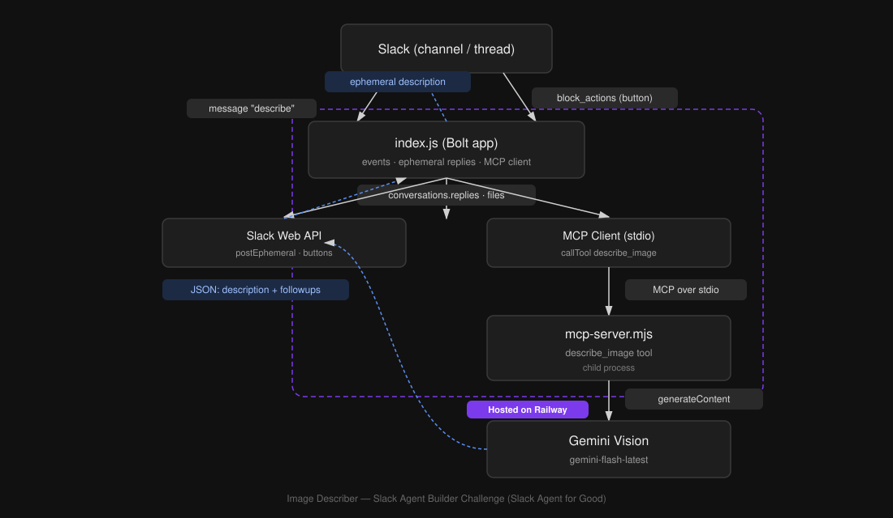

# Image Describer

A Slack agent that describes images for blind and low-vision users — built for the **Slack Agent Builder Challenge** (Slack Agent for Good track).

## The problem

Slack conversations are full of images — screenshots, memes, diagrams, photos — but none of that content is accessible to blind or low-vision teammates using screen readers. A screen reader announces "image attached" and stops there. Image Describer closes that gap by turning any image in a thread into a clear, spoken-friendly description, on demand, without cluttering the channel for everyone else.

## How it works

1. Someone posts an image in a Slack channel.
2. A user replies to that message in a thread with the word `describe`.
3. The bot fetches the parent message, finds the image, and downloads it.
4. It calls a `describe_image` tool exposed by a custom **MCP (Model Context Protocol) server**, which sends the image to **Gemini Vision** and gets back a structured description plus three tailored follow-up questions.
5. The bot replies **ephemerally** (visible only to the person who asked) with:
   - A plain-language description, written to be the first thing a screen reader announces
   - Up to three follow-up buttons for more detail on demand

Clicking a follow-up button sends another private reply with that specific answer.

## Architecture

- **`index.js`** — A Slack Bolt app. Listens for thread replies, handles Slack events and button interactions, and acts as an **MCP client**.
- **`mcp-server.mjs`** — A standalone MCP server exposing one tool, `describe_image`. This is the genuine MCP server integration: `index.js` spawns it as a child process and communicates over the standard MCP stdio transport.
- **Gemini Vision** (`gemini-flash-latest`) — Does the actual image understanding, prompted to return a short description plus three contextual follow-up Q&A pairs as JSON.

## Tech used

- **MCP server integration** — the core required technology for this build.
- **Slack Bolt (Node.js)** for the Slack app itself.
- **Google Gemini Vision API** for image understanding.

## Known limitations (by design, given the timeline)

- Handles one image per trigger, and only image files (not PDFs or other attachments).
- Reply-only trigger (`describe` in a thread) — no slash command yet.
- All responses are ephemeral — no "share with channel" option yet.
- Follow-up answers are generated once per image, not a live conversation.

## Why this matters

Accessibility tooling is often bolted on as an afterthought. Image Describer is small on purpose — it does one thing well, inside the tool teams already use every day.
